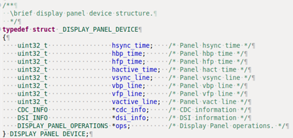
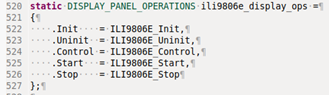
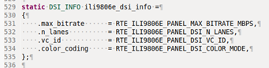
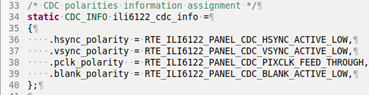
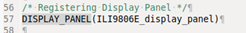
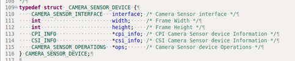
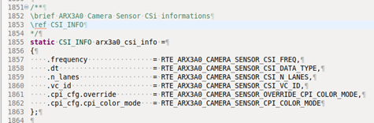
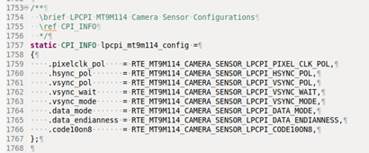
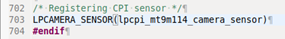

# Integrating Display panel

The following steps one must follow to integrate new panel driver to the project:

- For serial display panel, the following below functions need to be defined in display panel driver:
    - Initialize function for a display panel. 
      For e.g., for ILI9806E panel, we are resetting the panel after initializing, power on and     setting direction for reset pin, and initializing, giving power and setting direction for backlight led as output.
    - Configure the LCD panel using control function.
    - Start function for a display panel. 
      For e.g., for ILI9806E panel, we are enabling the backlight led by making the BL LED pin high for the display panel.
    - Un-initialize function for a display panel. 
      For e.g., for ILI9806E panel, we are making the reset pin low.
    - Stop function for a display panel. 
      For e.g., for ILI9806E panel, we are disabling the backlight led by making the BL LED pin low.

- For parallel display panel, we don’t need to initialize, power on and configure the panel as it auto does these tasks and so is the case now for ILI6122 display panel.

- Include the `display.h` header file in panel driver to access panel device structure. 
    

- Initialize the various members of display panel device structure either directly using values or using `RTE_device.h` file defined macros for same.

- Display panel operations structure member in display panel device structure taking care of registering callback functions for initialize, control, start, stop and un-initialize functions defined in the panel driver.
For parallel display panel, it does auto initialization and power on for panel, so we don’t need to register call the above callback functions in this case. 
    

- DSI info structure member within the display panel device structure taking care of registering following for DSI host according to display panel requirements: 
    
    - Maximum bit rate at which the display panel can receive data from DSI host.
    - Number of lanes on which display panel receiver DPHY will receive data from DSI host master DPHY.
    - ID of Virtual channel being used between DSI host and display panel for data transfer.
    - DSI color coding selection to get pixel format data from CDC using DPI interface from among all color coding that can be accepted by a particular display panel.

- CDC info structure member within the display panel device structure taking care of registering following for CDC200 according to display panel requirements if dealing with parallel display panel: 
    
    - Hsync polarity
    - Vsync polarity
    - Pixel clock output polarity
    - Blank polarity

- Other display panel device structure members which are being registered in display panel driver are timing parameters for HSYNC, HBP, HFP, HACTIVE, VSYNC, VBP, VFP, and VACTIVE signals for each frame that will be flushed to the panel.

- Register the new display panel with initialized panel device structure in panel driver.
This instruction will allow CDC and DSI drivers to access the initialized display panel device structure according to their requirement for various parameters. 
    

# Integrating camera sensor
The following steps one must follow to integrate new camera sensor to the project:
- For serial camera sensor or parallel camera sensor, the following below functions need to be defined in camera sensor driver: -
    - Initialize function for a camera sensor.
      For e.g., for ARX3A0 camera sensor, we are enabling sensor pixel clock, doing hard reset for camera reset and camera power pin, initializing i2c instance, doing soft reset for camera sensor, reading chip id, putting sensor in standby mode, start streaming for short delay and stop. 
      **Note:** We are putting serial camera sensor in standby mode because DPHY check for stop state on lanes during DPHY slave setup on CSI host side.
    - Configure the camera sensor and setting the camera gain using control function.
    - Start function for a camera sensor.
      For e.g., for ARX3A0 camera sensor, we are writing 1 to mode select register to start streaming.
    - Un-initialize function for a camera sensor.
      For e.g., for ARX3A0 camera sensor, we are disabling the sensor pixel clock.
    - Stop function for a camera sensor.
      For e.g., for ARX3A0 camera sensor, we are writing 0 to mode select register to stop streaming.

- Include the `camera_sensor.h` header file in camera sensor driver to access camera sensor device structure.

- Initialize the various members of camera sensor device structure either directly using values or using `RTE_device.h` file defined macros for same.

- CSI info structure member within the camera sensor device structure taking care of registering following for CSI host according to camera sensor output information: 
    
    - CSI clock frequency at which it will receive data from camera sensor.
    - CSI data type selection according to pixel format data a camera sensor is sending out to CSI host.
    - Number of lanes on which CSI host receiver DPHY will receive data transfer from camera sensor master DPHY.
    - ID of virtual channel on which data transfer between camera sensor and CSI host is taking place.
    - Selection of CSI host clock mode according to clock mode in which data transfer is done from camera sensor.
    - CPI override CSI color mode selection.

- CPI info structure member within the camera sensor device structure taking care of registering following for CPI controller if dealing for parallel camera sensor output information: 
    
    - Selection of vsync mode either to make vsync as data enable to capture data from parallel camera sensor or just as vsync signal.
    - Selection of vsync wait either to start capture on vsync from parallel camera sensor or start capturing without waiting for vsync.
    - Selecting polarities of hsync, vsync and pixel clock signals that CPI will receive as from the camera sensor.
    - Selecting data mode of CPI for pixel format in which data will be stored in the memory.
    - Selection of data endianness to decide how CPI controller should store data captured by camera sensor.
    - Selection of data mask to take only masked bits of data captured by parallel camera sensor.
    - Selection of either enabling or disabling transfer 10 bit coding on 8bit data bus.

- Other camera sensor device structure members which are being registered in camera sensor driver are width and height of the frame that the camera sensor is capturing.

- Register the new camera sensor with initialized camera sensor structure in camera sensor driver.
This instruction will allow CPI and CSI drivers to access the initialized camera sensor device structure according to their requirement for various parameters. 

